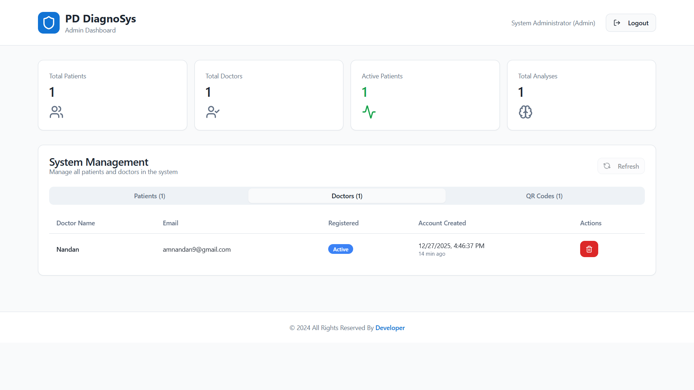
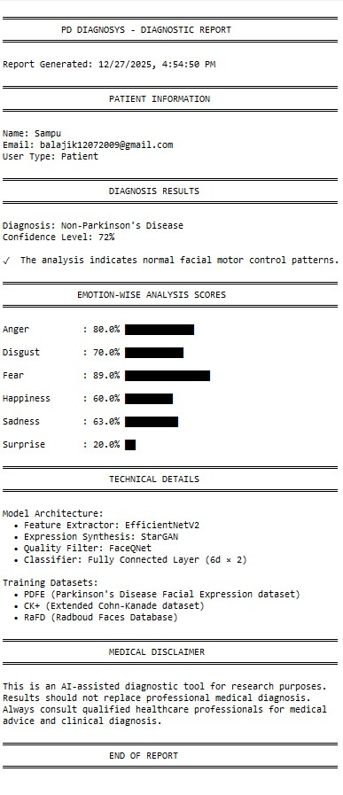
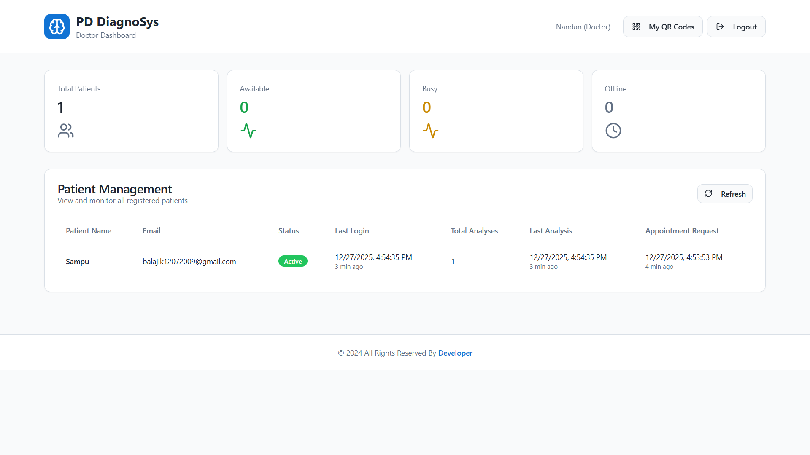
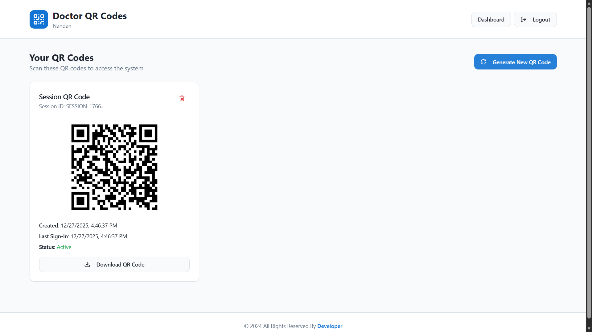
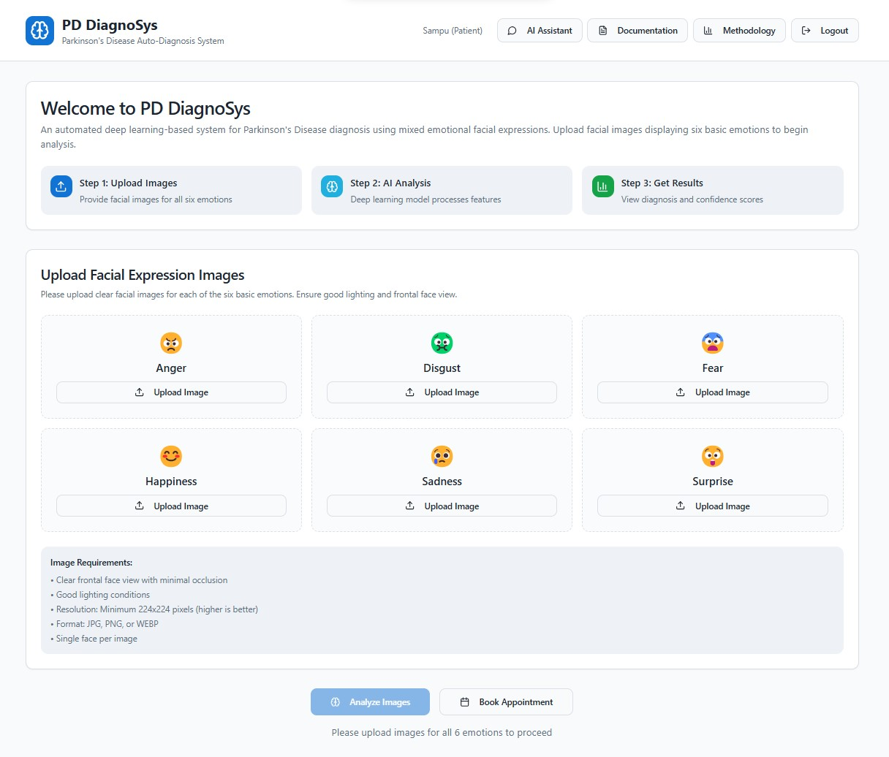
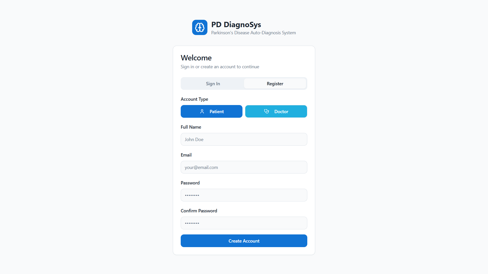
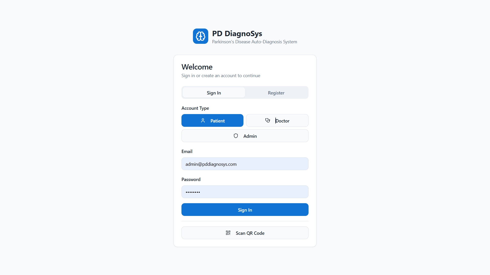

# 🧠 AI-Driven Parkinson’s Disease Detection System

An **end-to-end AI-powered Parkinson’s Disease detection platform** that analyzes **facial expressions** using deep learning to assist in **early diagnosis and severity assessment**.  
The system integrates **computer vision, machine learning, and a full-stack web interface** for research and experimental screening.


## 📸 Project Screenshots

<table>
  <tr>
    <td></td>
    <td></td>
    <td rowspan="3" align="center">
      
    </td>
    <td></td>
  </tr>

  <tr>
    <td></td>
    <td></td>
    <td></td>
  </tr>

  <tr>
    <td></td>
    <td></td>
    <td></td>

  </tr>
</table>


## ⚙️ Overview

This project implements a **complete machine learning pipeline**:
- Facial expression–based Parkinson’s detection
- Multi-dataset training and evaluation
- Robust preprocessing and augmentation
- Web-based interface with backend inference
- Scalable and modular system architecture

Designed for **academic, research, and experimental healthcare applications**.

---

## 📌 Key Features

- 🧠 AI-based Parkinson’s Disease detection using facial expressions  
- 📷 Face detection, alignment, and landmark extraction  
- 📊 Multi-dataset training & evaluation pipeline  
- 🔍 Emotion-aware facial feature analysis  
- ⚙️ End-to-end preprocessing & normalization  
- 🌐 Full-stack web interface (frontend + backend)  
- 🚀 Real-time inference support (image/video-ready)  
- 📁 Modular and scalable project design  
- 🧪 Research-friendly and reproducible workflow  

---

## 📊 Datasets Used

### PDFE (Parkinson’s Disease Facial Expression)
- Subjects: PD patients and healthy controls  
- Emotions: 6 basic facial emotions  

### CK+ (Extended Cohn–Kanade)
- Images: 10,000+  
- Subjects: 123 participants  

### RaFD (Radboud Faces Database)
- Images: 8,040  
- Expressions: 8 expressions × 5 angles  

---

## 🔄 Preprocessing Pipeline

1. Face Detection – OpenCV Haar Cascade / Dlib HOG  
2. Landmark Detection – 68-point facial landmarks (Dlib)  
3. Face Alignment – Affine transformation using eye coordinates  
4. Cropping – Center crop to 128×128  
5. Resizing – Upscale to 224×224 for model input  
6. Normalization – ImageNet mean and standard deviation  
7. Augmentation – Horizontal flip and small rotations (±5°)  
---
## 🏗️ Project Structure
```
parkinsons-disease-detection/
├── ai/                     # ML models and training logic
├── src/                    # Core application logic
├── public/                 # Static frontend assets
├── image/                  # Dataset samples & documentation images
├── server.js               # Backend server (Node.js)
├── test-server.js          # Server testing utilities
├── index.html              # Frontend entry point
├── components.json         # UI component configuration
├── package.json            # Frontend & backend dependencies
├── vite.config.ts          # Vite configuration
├── tailwind.config.ts      # Tailwind CSS setup
├── tsconfig*.json          # TypeScript configuration
├── .env.example            # Environment variable template
├── README.md               # Project documentation
├── README-SERVER.md        # Backend documentation
├── START-SERVER.md         # Server startup guide
```
## 🙏 Special Thanks

I would like to express my sincere gratitude to all the individuals who have **knowingly and unknowingly contributed** to the development of this project.

This includes:
- Mentors, educators, and peers who shared their knowledge and guidance
- Developers and researchers whose open-source work and discussions inspired key ideas
- Online communities, forums, and documentation that helped resolve challenges
- Friends and collaborators who provided feedback, suggestions, and motivation

Their collective insights, resources, and support played a crucial role in shaping this project and making its successful completion possible.
